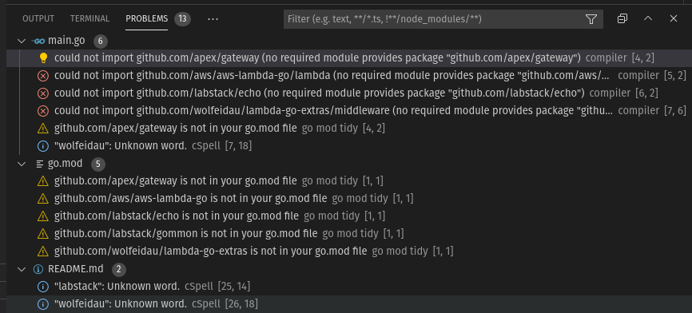

# demo-golang-1.6

So if we start with an empty project and then copy paste some code, I know right who even does that?!

* Add this to your main function.

```go
	e := echo.New()

	gw := gateway.NewGateway(e)

	ch := middleware.New()

	h := ch.Then(gw)

	lambda.StartHandler(h)
```

Add the imports and save.

```go
import (
	"github.com/apex/gateway"
	"github.com/aws/aws-lambda-go/lambda"
	"github.com/labstack/echo/v4"
	"github.com/wolfeidau/lambda-go-extras/middleware"
)
```

Now as a developer your like ok.. what do I do now?

So I opened the "Problems" tab and see these "go mod" warnings, do these justify a bit more prominence?



I really liked the 1.15 experience of go modules being updated automatically, with the odd mistake leaking in as this seemed to work well with new developers.